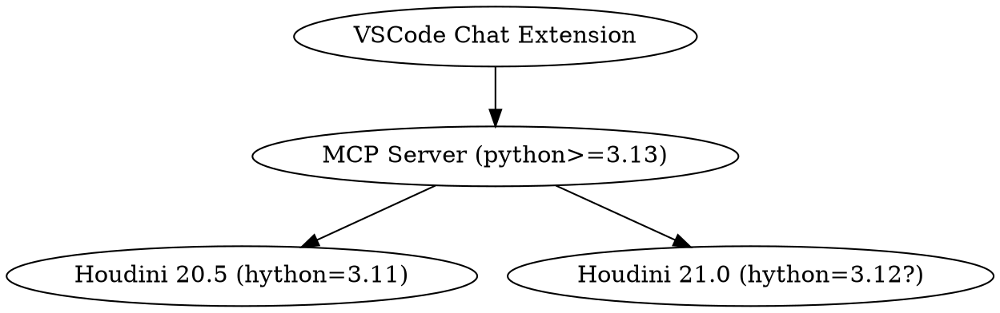

# Contributions are welcome

There are 3 layers here, many contributions can be focused on a single layer.

Documentation improvements cuts across all layers, and are especially welcome!

## VSCode Chat agent

This layer is in typescript, and has access to the chat interface in VSCode, and the model access it gives.

## Main MCP server

This is in python, and responds with generic Houdini information, that doesn't need access to the Houdini API. It can use modern Python features without concern for compatibility with the houdini environment.

Currently, it runs in python 3.13.

## Houdini Services

Either as a standalone program returning requested information, or a server running within Houdini, this needs to be compatible with specific Houdini versions and their associated python/hython versions.

Houdini 20.5 (current as of 2025-05-15) uses python 3.11.

I expect Houdini 21.0 no earlier than July, and using python 3.12.

## General principles

- Any content needs to be licensable under the MIT license.
- Make sure your contribution passes the full test suite.
- Use spaces, not tabs!
- Don't use auto-formatters on existing files. I have not seen
  one that handles complex comprehensions well.
- My only formatting/style rule is, strive for readability.
- Documentation improvements are especially welcome.
- Merges are acceptable in the git history, but whether by merge
  or rebase, bring your submissions up-to-date.
- Where possible, create tests for your code.
- If you need help, submit a PR anyway and ask for help. You can
  mark it as a draft.

More info:

- Read [RELEASE.md](RELEASE.md) for information about how releases are done.
- Read [test/README.md](test/README.md) for information about testing.
- [Instructions for LLMs contributing or commenting](.prompt.md) (but good advice for humans, too).
